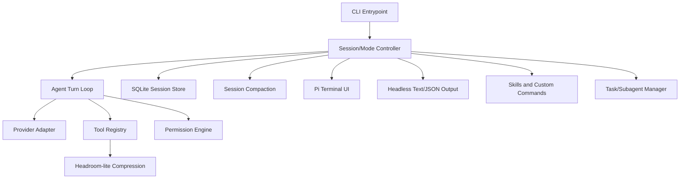

# Furnace

Furnace is a terminal-first agentic coding harness built from scratch in TypeScript. It runs an AI coding loop against real repositories with streamed model output, typed tools, permission gates, local SQLite session history, context compaction, multimodal image input, skills, subagents, and a Pi-based TUI.

The project is still early, but it is no longer just a plan: the current codebase is a usable local coding-agent CLI with interactive and headless modes.

## What Furnace Does Today

- Runs interactive agent sessions in a terminal UI.
- Runs one-shot/headless prompts with text or JSON output.
- Streams chat completions and tool calls through OpenRouter, Anthropic, and custom OpenAI-compatible providers.
- Persists local sessions in SQLite at `.furnace/furnace.sqlite`.
- Replays sessions as append-only active-leaf histories with fork support.
- Reads, searches, edits, writes files, and runs bounded shell commands through typed tools.
- Uses a permission engine for risky tools.
- Tracks file reads and warns on stale writes/edits.
- Compacts long conversations with model-assisted summaries and deterministic fallback.
- Compresses oversized tool output into retrievable local artifacts.
- Supports multiple image attachments in a single prompt.
- Supports project/user/plugin skills and reusable custom slash commands.
- Delegates independent work to subagent task groups.
- Provides plan mode for implementation planning before mutating code.
- Can create a compact local repository index for faster project orientation.
- Provides four structural UI layouts plus configurable themes, status line fields, model settings, and typing indicators.
- Shows an early-access feedback banner linking directly to the Furnace issue tracker.
- Shows local What’s New notes once per installed version; the full history lives at
  [furnace.unordinary.software/changelog](https://furnace.unordinary.software/changelog).

## Requirements

- Node.js 22.x.
- A provider API key configured through `/login` or an environment variable.

## Install And Update

Install the published CLI from npm:

```bash
npm install -g cook-furnace
```

Update an existing global install to the latest published version:

```bash
furnace update
# or
furnace --update
```

The self-update command uses npm. Source checkouts must be updated with Git and
rebuilt locally.

Check the installed version:

```bash
furnace --version
```

The npm package is `cook-furnace`, but the installed command is `furnace`.

## Quickstart

Start Furnace, then type `/login` to choose a provider and save an API key:

```bash
furnace
```

Run from a source checkout:

```bash
npm install
npm run dev
```

Run a single prompt without opening the TUI:

```bash
npm run dev -- -p "Reply with exactly: ok"
```

Build and run the compiled CLI:

```bash
npm run build
npm run start -- --help
```

Run verification:

```bash
npm run verify
```

`npm run verify` is the pre-push check. It runs the pinned Node check, TypeScript typecheck, the full test/build script, and the npm package dry run, then prints whether each step passed.

Run individual checks when you only need one part:

```bash
npm run typecheck
npm test
npm run pack:dry-run
```

## CLI Usage

Interactive mode starts by default:

```bash
npm run dev
```

Headless prompt mode:

```bash
npm run dev -- -p "Summarize this repository"
```

Continue or resume sessions:

```bash
npm run dev -- --continue
npm run dev -- --session <session-id>
```

Use JSON output for headless mode:

```bash
npm run dev -- -p "List changed files" --output-format json
```

Generate shell completions:

```bash
npm run dev -- completion bash
npm run dev -- completion zsh
npm run dev -- completion fish
```

## Interactive Commands

Built-in slash commands include:

| Command | Purpose |
| --- | --- |
| `/new` | Start a fresh conversation. |
| `/resume`, `/history` | Browse saved conversations; press `Tab` on a highlighted chat to pin or unpin it. |
| `/fork [current\|prompt-preview]` | Fork the current conversation or a prior user prompt. |
| `/clone` | Fork from the current conversation tip. |
| `/image <path\|url>` | Attach an image to the next message. |
| `/model` | Browse/select model and configure context, max output, reasoning, and fast routing. |
| `/theme [name]` | Select a theme; browsing previews hovered themes. |
| `/settings`, `/prefs` | Configure UI/status preferences. |
| `/evolve <what to change>` | Modify the Furnace harness itself, with verification and recovery. |
| `/evolve-merge` | Ask the agent to reapply preserved evolve changes after an upgrade conflict. |
| `/reset` | Reset the Furnace harness to its default state (undo all evolve changes). |
| `/plan [prompt]` | Switch to plan mode. |
| `/agent` or `/mode agent` | Switch back to normal agent mode. |
| `/tasks` | Show active subagents. `Ctrl+K` toggles live task details. |
| `/pin` | Pin or unpin the current chat (up to five). |
| `/pins [slot]` | List pinned chats or switch to a slot. `Ctrl+P` focuses the panel; `Ctrl+G` shows or hides it. |
| `/compact [focus]` | Manually summarize old context. |
| `/init` | Force learning the current git worktree and write `.furnace/repo-index.md`. |
| `/skills list` | List discovered skills. |
| `/skills view <name>` | View a skill. |
| `/skills reload` | Reload skill discovery. |
| `/permissions` | View/clear conversation approvals. |
| `/status` | Show session/model/mode/context status. |
| `/change` | Reopen What’s New for the latest Furnace version. |
| `/export [json] [path]` | Export the conversation. |
| `/diff` | Show files changed this session. |
| `/undo` | Revert the most recent file-changing tool call. |
| `/copy` | Copy the last assistant response. |
| `/cost` | Show token/cost usage estimates. |
| `/usage` | Show a 12-month token-usage grid, accepted agent lines, and recorded cost for the active API key. |
| `/editor` | Compose a message in `$EDITOR`. |
| `/lofi` | Toggle lofi mode. |
| `/snow [low\|medium\|hard]` | Toggle animated snowfall over the current layout or set its intensity. |
| `/tip` | Toggle rotating tips on the idle Agent-mode editor. |
| `/stfu` | Toggle minimal, no-narration response mode. |
| `/caveman` | Toggle short caveman-style user-facing prose. |
| `/clear` | Clear the conversation display. |
| `/exit`, `/quit` | Exit Furnace. |

Messages submitted while Furnace is working are queued in order. Each
conversation keeps its own queue while you switch among pinned chats. Press
`Alt+Up` with an empty draft to edit the newest queued message, including its
image attachments; keep pressing it to move toward the oldest, and use
`Alt+Down` to move back toward the newest. Press `Alt+Enter` to interrupt at a
safe boundary and send the current draft—or the next queued message if the
draft is empty—next. While editing an accented queued message, press `Enter` to
save it back in place, `Alt+Backspace` to delete it, or `Esc` to cancel the edit
without interrupting the chat.

On Windows, the same Alt shortcuts are supported. Because some terminal hosts
reserve `Alt+Enter`, Furnace also provides `Shift+F5` to send, `Shift+F6` and
`Shift+F7` to move through the queue, and `Shift+F8` to delete the selected
queued prompt. The UI displays the effective shortcuts for the current OS.

Interrupting an active turn with `Esc` pauses that conversation’s queue instead
of automatically sending the next follow-up. Sending a new message, saving a
queued edit, or explicitly sending a queued prompt resumes normal FIFO
processing.

`/new`, `/resume`, and its `/history` alias remain available while a chat is
working. The previous chat continues in the background with its own queue and
runtime state; returning through resume or a pinned-chat slot restores both.

Set `FURNACE_REDUCED_MOTION=1` to keep snowfall enabled as a still overlay.

Custom slash commands can live under `.furnace/commands` in the project or `~/.furnace/commands` globally.

`/stfu` and `/caveman` are independent runtime toggles: either, both, or
neither can be active. Active response modes appear in the footer in every
layout. They modify only user-facing response style; tool use, permissions,
reasoning quality, verification, safety, and other workflows remain unchanged.
The base section is in `src/prompts/base-system.md`; the selectively attached
guidance lives in `src/response-modes.ts`. The model sees only the guidance
currently selected, never mode names, slash commands, or inactive guidance.

## Settings

`/settings` opens a keyboard-driven preferences panel. Current settings include:

- New installations default to the `Classic` layout with the `Gruvbox` theme.
- Interface layout:
  - `Classic`: the original banner, transcript, composer, and footer stack
  - `Console`: an operator layout with top telemetry and a bottom command deck
  - `Notebook`: an editorial conversation log with labelled entries
  - `Asteroid`: a space-themed layout with asteroid-field framing
- Input cursor: block, underscore, or bar.
- Input cursor blink: off/on, applied to the cursor in the prompt area.
- Notifications on/off.
- Idle tips on/off. Tips are on by default and stay hidden during work, Plan mode, questions, and popups.
- Status line fields:
  - Cost can show the current session, the all-project total for the active API key, or be hidden.
  - app name
  - cwd
  - title
  - context: on, token+percent, percent-only, or off
  - mode
  - window
  - theme
  - model
  - reasoning
  - fast routing
  - fork parent

`Tab` or `Enter` cycles values.

`/model` opens model-specific settings. Furnace defaults model turns to `8192` max output tokens to avoid unexpectedly large provider reservations; advanced users can change that cap from the model editor.

## Evolving the harness

Furnace can modify its own source. Ask for a harness change in plain language
("put cost usage on the statusline", "add a monochrome green theme", "make the
thinking text say huzzing") and the agent routes it into the evolve flow, or run
it explicitly:

```bash
/evolve add cost usage to the statusline
```

An evolve run:

1. Creates a **recovery point** — a git snapshot plus a copy of the current
   known-good `dist/`.
2. Edits the Furnace source for your request.
3. Verifies with a typecheck, an isolated build to a temp location, and a launch
   check that runs the new bundle in a subprocess (this catches a change that
   compiles but crashes on startup). The live `dist/` is only swapped after all
   of these pass, so a bad change never bricks the `furnace` command. Verification
   runs asynchronously and does not freeze the UI.
4. Shows you the diff and asks you to approve it before it goes live.
5. Shows the recovery command in a final restart prompt. Choosing **Restart
   now** cleanly closes and relaunches Furnace with the approved build.

The prompt editor is locked from the start of source preparation through agent
editing, verification, approval, and the final restart/error popup. It is
enabled again only after the flow and its popup finish; a confirmed restart
keeps it locked while Furnace shuts down.

If a restart lands on a broken harness, roll back:

```bash
furnace --recover <id>
```

Recovery restores the previous known-good `dist/` without rebuilding. In the rare
case the bundle will not launch at all, rebuild from source with `npm run build`
in the Furnace checkout.

Notes and current limits:

- Source checkouts evolve in place. Published npm installations automatically
  download version-matched source into `~/.furnace/evolve/sources/` using the
  release tag or npm's recorded publish commit, install its build dependencies,
  and activate an approved evolved bundle for the next normal `furnace` launch.
- After a published Furnace upgrade, cumulative evolved source changes are
  reapplied three-way onto the new version and verified automatically. Tracked
  and untracked evolve changes are both preserved. If Git or verification
  cannot reconcile them, Furnace runs the new stock version, preserves the old
  customization, patch, and migration checkout, and shows a popup offering
  **Reapply previous evolve changes** via `/evolve-merge`. That command delegates
  conflict resolution to the agent, reviews and verifies the result, then
  offers to restart into it. Choosing **Later** dismisses the migration for that
  Furnace version; startup does not retry or prompt again until another version
  is installed.
- The evolve edit turn runs with broad session permissions over the Furnace
  root; the diff-review step is your control. It can read `~/.furnace/auth.json`,
  so review the diff before approving.
- Recovery points accumulate git tags under `refs/tags/furnace-recovery/`.

## Images

Interactive sessions can attach one or more images before sending a prompt:

```bash
> /image screenshot-a.png
> /image screenshot-b.png
> Compare [Image #1] and [Image #2]
```

Furnace supports local JPEG, PNG, GIF, and WebP files, plus remote image URLs. Local images are validated, stored with the session, and sent as multimodal message content when the selected model supports image input.

## Tools

The built-in model tools are:

- `read`, `ls`, `find`, `glob`, `grep`
- `write`, `edit`
- `bash`
- `ask_question`
- `todoread`, `todowrite`
- `task`, `task_status`
- `skill`, `skill_manage`
- `websearch`, `webfetch`
- `context_retrieve`

Each tool has a schema, permission metadata, execution logic, and bounded model-facing output.

## Repository Index

In interactive mode, Furnace can offer to initialize a git worktree by creating `.furnace/repo-index.md`. The prompt appears only when an API key is configured and that worktree has not answered the prompt before. Choosing **No** is remembered and Furnace will not ask again.

The index is a compact map for the agent, not generated docs. It uses fixed sections like `Project Shape`, `Key Directories`, and `File Dictionary`, and should stay under 250 lines when possible. Furnace keeps onboarding and upstream-tracking state in `.furnace/repo-index.meta.json`.

Use `/init` to force regeneration at any time, including after declining onboarding. The `/settings` **Repo reindexing** option defaults to **agent decides**, which has the main agent use and maintain the index as it works. Choose **every git push** to watch the tracked upstream and regenerate with a low-cost model in the background. Background indexing does not block input and shows its own status row.

Current session behavior:

- New chats are hidden from history until they contain useful content.
- `/resume` lists normal sessions and forked sessions.
- Forks are first-level branches from an original session.
- `/fork` opens a picker of valid fork points.
- `/fork current` and `/clone` fork through the current active leaf.
- Subagent sessions are related to their parent but hidden from normal history.

## Safety Model

Furnace is designed to be useful on real repositories without requiring blind trust.

Local data storage:

- Conversation history, tool calls, tool results, todo state, fork metadata, file-read tracking, and image attachment metadata are stored in `.furnace/furnace.sqlite` for the current workspace.
- Large compressed tool-output originals are stored separately under `.furnace/context-store/`.
- `.furnace/` is intended to be local-only state. Furnace excludes it through local git excludes when possible, and this repo also ignores it in `.gitignore`.

Defaults:

- Low-risk read/search/question/task/todo/web tools are allowed by default.
- `write`, `edit`, `bash`, and `skill_manage` ask by default.
- `.env` and `.env.*` reads are denied; `.env.example` is allowed.
- Writes outside the workspace require explicit external paths and approval.
- Tool permissions are session-scoped and visible through `/permissions`.
- Plan mode denies implementation side effects except the active plan artifact and safe read-only shell commands.
- Large tool outputs are bounded before model replay and preserved locally for retrieval.

Furnace currently uses permission gates rather than an OS/container sandbox.

## Architecture

Furnace is organized around a reusable agent runtime with the TUI as one surface.



Start with [DOCS.md](DOCS.md) for the complete architecture and contributor guide.

