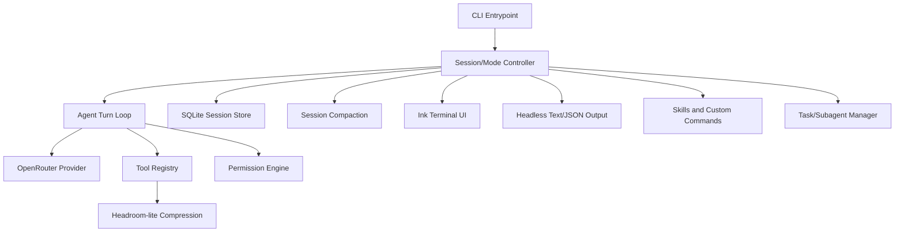

# Furnace

Furnace is a terminal-first agentic coding harness built from scratch in TypeScript. It runs an AI coding loop against real repositories with streamed model output, typed tools, permission gates, local SQLite session history, context compaction, multimodal image input, skills, subagents, and an Ink-based TUI.

The project is still early, but it is no longer just a plan: the current codebase is a usable local coding-agent CLI with interactive and headless modes.

## What Furnace Does Today

- Runs interactive agent sessions in a terminal UI.
- Runs one-shot/headless prompts with text or JSON output.
- Streams OpenRouter chat completions and tool calls.
- Persists local sessions in SQLite at `.furnace/furnace.sqlite`.
- Replays sessions as append-only active-leaf histories with fork support.
- Reads, searches, edits, writes files, and runs bounded shell commands through typed tools.
- Uses a permission engine for risky tools.
- Tracks file reads and warns on stale writes/edits.
- Compacts long conversations with model-assisted summaries and deterministic fallback.
- Compresses oversized tool output into retrievable local artifacts.
- Supports multiple image attachments in a single prompt.
- Supports project/user/plugin skills and reusable custom slash commands.
- Delegates independent work to subagent task groups.
- Provides plan mode for implementation planning before mutating code.
- Provides configurable themes, status line fields, model settings, and typing indicators.

## Requirements

- Node.js 22.x only. The repo is pinned to Node `22.22.3` via `.nvmrc` and `.node-version`.
- npm.
- An OpenRouter API key in `.env`.

The scripts use `scripts/with-node22.sh` so native `better-sqlite3` stays compiled for the Node 22 ABI. If you switch Node versions, rebuild:

```bash
nvm use
npm rebuild better-sqlite3
```

## Quickstart

Create a local env file:

```bash
cp .env.example .env
```

Add your OpenRouter key to `.env`, then install and start:

```bash
npm install
npm run dev
```

Run a single prompt without opening the TUI:

```bash
npm run dev -- -p "Reply with exactly: ok"
```

Build and run the compiled CLI:

```bash
npm run build
npm run start -- --help
```

Run verification:

```bash
npm run typecheck
npm test
```

## CLI Usage

Interactive mode starts by default:

```bash
npm run dev
```

Headless prompt mode:

```bash
npm run dev -- -p "Summarize this repository"
```

Continue or resume sessions:

```bash
npm run dev -- --continue
npm run dev -- --session <session-id>
```

Use JSON output for headless mode:

```bash
npm run dev -- -p "List changed files" --output-format json
```

Generate shell completions:

```bash
npm run dev -- completion bash
npm run dev -- completion zsh
npm run dev -- completion fish
```

## Interactive Commands

Built-in slash commands include:

| Command | Purpose |
| --- | --- |
| `/new` | Start a fresh conversation. |
| `/resume`, `/history` | Browse saved conversations. |
| `/fork [current\|prompt-preview]` | Fork the current conversation or a prior user prompt. |
| `/clone` | Fork from the current conversation tip. |
| `/image <path\|url>` | Attach an image to the next message. |
| `/model` | Browse/select model and configure context/reasoning/fast routing. |
| `/theme [name]` | Select a theme; browsing previews hovered themes. |
| `/settings`, `/prefs` | Configure UI/status preferences. |
| `/plan [prompt]` | Switch to plan mode. |
| `/agent` or `/mode agent` | Switch back to normal agent mode. |
| `/tasks` | Show active subagents. |
| `/compact [focus]` | Manually summarize old context. |
| `/skills list` | List discovered skills. |
| `/skills view <name>` | View a skill. |
| `/skills reload` | Reload skill discovery. |
| `/permissions` | View/clear conversation approvals. |
| `/status` | Show session/model/mode/context status. |
| `/export [json] [path]` | Export the conversation. |
| `/diff` | Show files changed this session. |
| `/undo` | Revert the most recent file-changing tool call. |
| `/copy` | Copy the last assistant response. |
| `/cost` | Show token/cost usage estimates. |
| `/editor` | Compose a message in `$EDITOR`. |
| `/lofi` | Toggle lofi mode. |
| `/clear` | Clear the conversation display. |
| `/exit`, `/quit` | Exit Furnace. |

Custom slash commands can live under `.furnace/commands` in the project or `~/.furnace/commands` globally.

## Settings

`/settings` opens a keyboard-driven preferences panel. Current settings include:

- Sidebar on/off.
- Input mode: standard or vim.
- Typing indicator: block, underscore, or bar.
- Typing blink: off/on, applied to any indicator style.
- Notifications on/off.
- Status line fields:
  - app name
  - cwd
  - title
  - context: on, token+percent, percent-only, or off
  - mode
  - window
  - theme
  - model
  - reasoning
  - fast routing
  - fork parent

`Tab` or `Enter` cycles values.

## Images

Interactive sessions can attach one or more images before sending a prompt:

```bash
> /image screenshot-a.png
> /image screenshot-b.png
> Compare [Image #1] and [Image #2]
```

Furnace supports local JPEG, PNG, GIF, and WebP files, plus remote image URLs. Local images are validated, stored with the session, and sent as multimodal message content when the selected model supports image input. See [docs/image-support.md](docs/image-support.md).

## Tools

The built-in model tools are:

- `read`, `ls`, `find`, `glob`, `grep`
- `write`, `edit`
- `bash`
- `ask_question`
- `todoread`, `todowrite`
- `task`, `task_status`
- `skill`, `skill_manage`
- `websearch`, `webfetch`
- `context_retrieve`

Each tool has a schema, permission metadata, execution logic, and bounded model-facing output. See [docs/tools.md](docs/tools.md).

## Sessions, Forks, And Subagents

Sessions are stored locally in SQLite at `.furnace/furnace.sqlite` inside the current workspace and represented as append-only entry trees. Furnace keeps an active leaf for each conversation path instead of rewriting old history.

The `.furnace/` directory is local runtime state and should stay gitignored. Deleting `.furnace/furnace.sqlite` removes saved Furnace conversations for that workspace.

Current session behavior:

- New chats are hidden from history until they contain useful content.
- `/resume` lists normal sessions and forked sessions.
- Forks are first-level branches from an original session.
- `/fork` opens a picker of valid fork points.
- `/fork current` and `/clone` fork through the current active leaf.
- Subagent sessions are related to their parent but hidden from normal history.

See [docs/session-management.md](docs/session-management.md) and [docs/forking-and-branching.md](docs/forking-and-branching.md).

## Context Management

Furnace has two complementary context systems:

1. **Session compaction** summarizes older conversation entries when context gets large or when `/compact` is run.
2. **Headroom-lite tool-output compression** compresses oversized tool outputs while saving the full original locally.

Compressed originals are stored under:

```txt
.furnace/context-store/ctx_<id>.txt
```

The model can retrieve them with:

```txt
context_retrieve({"id":"ctx_..."})
```

See [docs/compaction.md](docs/compaction.md) and [docs/headroom-lite.md](docs/headroom-lite.md).

## Safety Model

Furnace is designed to be useful on real repositories without requiring blind trust.

Local data storage:

- Conversation history, tool calls, tool results, todo state, fork metadata, file-read tracking, and image attachment metadata are stored in `.furnace/furnace.sqlite` for the current workspace.
- Large compressed tool-output originals are stored separately under `.furnace/context-store/`.
- `.furnace/` is intended to be local-only state and is ignored by this repo's `.gitignore`.

Defaults:

- Low-risk read/search/question/task/todo/web tools are allowed by default.
- `write`, `edit`, `bash`, and `skill_manage` ask by default.
- `.env` and `.env.*` reads are denied; `.env.example` is allowed.
- Writes outside the workspace require explicit external paths and approval.
- Tool permissions are session-scoped and visible through `/permissions`.
- Plan mode denies implementation side effects except the active plan artifact and safe read-only shell commands.
- Large tool outputs are bounded before model replay and preserved locally for retrieval.

Furnace currently uses permission gates rather than an OS/container sandbox.

## Architecture

Furnace is organized around a reusable agent runtime with the TUI as one surface.



Important source areas:

- `src/cli.ts` — CLI entrypoint and Commander setup.
- `src/interactive-session-controller.ts` — interactive/headless/piped session orchestration.
- `src/prompt-queue.ts`, `src/session-switching.ts`, `src/slash-command-router.ts`, `src/task-ui-bridge.ts` — focused orchestration helpers.
- `src/agent/loop.ts` — reusable streamed agent loop and tool-call iteration.
- `src/openrouter.ts` — OpenRouter completion/model-list integration.
- `src/tools/registry.ts` and `src/tools/*` — built-in tool schemas, dispatch, and domain handlers.
- `src/permissions.ts` — permission engine and plan-mode gating.
- `src/session/store.ts` — SQLite session and entry persistence.
- `src/session/context.ts` — session entries to model messages/transcript rows.
- `src/session/compaction.ts` — context compaction.
- `src/compression/*` — Headroom-lite output compression.
- `src/ui/ink-terminal.tsx` and `src/ui/components/*` — terminal UI.
- `src/commands.ts` — built-in slash command definitions.
- `src/skills/*` — skill discovery/loading/management.
- `src/tasks/*` — delegated subagent tasks.
- `src/preferences.ts` — global/project preferences.

## Documentation

Useful docs:

- [Tools](docs/tools.md)
- [Skills](docs/skills.md)
- [Session management](docs/session-management.md)
- [Forking and branching](docs/forking-and-branching.md)
- [Compaction](docs/compaction.md)
- [Headroom-lite](docs/headroom-lite.md)
- [Image support](docs/image-support.md)
- [Clipboard image paste](docs/clipboard-paste-images.md)
- [Delegation and subagents](docs/delegation-subagents.md)
- [Interaction model](docs/interaction-model.md)
- [Plan mode](docs/plan.md)
- [Design choices](docs/design-choices.md)

## Current Limitations

- Provider support is OpenRouter-first.
- Interactive orchestration is still evolving, but it is split out of the CLI entrypoint into focused controller modules.
- There is no container/OS sandbox adapter yet.
- JSON/headless output exists, but there is not yet a stable public RPC/SDK event API.
- The TUI is featureful and still evolving, especially around focus, autocomplete, and settings panels.

## Prior Art

Furnace borrows lessons from existing coding agents without trying to clone any single one:

- Pi: minimal TypeScript harness and extension-first design.
- OpenCode: keeping runtime concerns separate from terminal clients.
- Codex CLI: strong sandboxing as a long-term trust model.
- Claude Code: one engine across terminal, IDE, SDK, hooks, skills, and background agents.
- Headroom: reversible, content-aware compression of large tool output.
