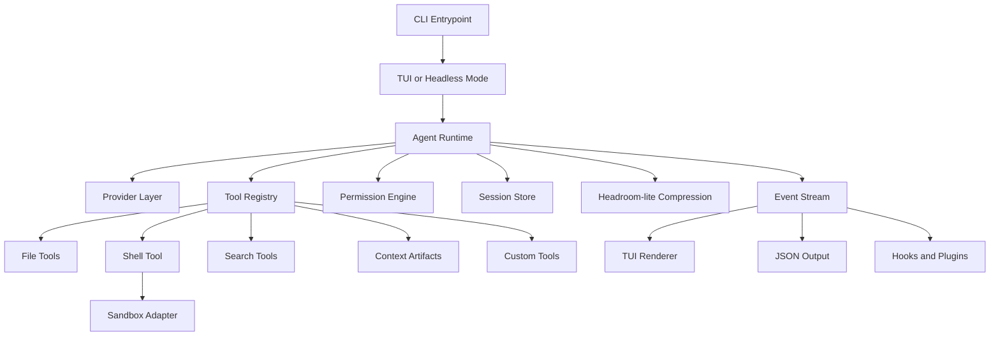

# Furnace

Furnace is a from-scratch harness for agentic coding. The goal is to build the runtime layer that lets an AI coding agent read code, edit files, run commands, ask for approval, persist sessions, and expose the same engine through a terminal UI, headless CLI, JSON mode, RPC, and future editor integrations.

This project starts intentionally small. The first useful version should not try to clone every feature from Claude Code, Codex, OpenCode, or Pi. It should prove the core loop is solid, safe, observable, and easy to extend.

## Goals

- Build a terminal-first agentic coding harness.
- Keep the runtime separate from the UI.
- Support streaming model responses and tool calls.
- Provide safe default permissions for edits and shell commands.
- Persist sessions as replayable event logs.
- Make tools, skills, hooks, and providers extensible.
- Add stronger sandboxing over time.

## Non-Goals For The First Version

- Full multi-agent orchestration.
- A complete MCP ecosystem.
- Native OS sandboxing on every platform.
- A polished desktop or IDE experience.
- Complex plugin package management.

Those can come later. The first milestone is a small harness that can reliably run one agent loop against a real repository.

## Quickstart

Create a local `.env` file with an OpenRouter key:

```bash
cp .env.example .env
```

Then run:

```bash
npm install
npm run dev
```

You can also send a single prompt without the input screen:

```bash
npm run dev -- -p "Reply with exactly: ok"
```

Build and run the compiled CLI:

```bash
npm run build
node dist/cli.js --help
```

### Images

Interactive sessions can attach one or more images before sending a prompt:

```bash
> /image screenshot.png
> what UI improvements would you suggest?
```

Furnace supports local JPEG, PNG, GIF, and WebP files, plus remote image URLs. Local images are validated, stored with the session, and sent as multimodal message content. See [docs/image-support.md](docs/image-support.md) for details.

## Current State

The current implementation has grown into a usable early coding harness:

- TypeScript project setup.
- `furnace` CLI entrypoint.
- Base system prompt in `src/prompts/base-system.md`.
- OpenRouter streaming chat completion call.
- Interactive Ink terminal UI and headless `-p` mode.
- File/search/edit/bash/web/question/skill/subagent tools.
- SQLite session persistence with durable tool calls/results.
- Context compaction for long sessions.
- Headroom-lite compression for oversized tool outputs and replayed tool results.
- Multimodal image attachments in interactive sessions.
- `.env.example` and `.gitignore` for local secret handling.
- Tests for package wiring, tools, permissions, sessions, compaction, skills, and compression.

## Architecture

Furnace is designed around a reusable runtime. The terminal UI is only one surface on top of it.



## Planned Stack

- Language: TypeScript.
- Runtime: Node.js 22+.
- CLI parser: Commander or Yargs.
- Schemas: Zod or TypeBox.
- TUI: React Ink for fast iteration, or OpenTUI/Solid if the TUI becomes the differentiator.
- Storage: JSONL session logs first, with SQLite indexing later if needed.
- Providers: Anthropic, OpenAI Responses API, and OpenAI-compatible endpoints.
- Safety: permission gates first, sandbox adapters later.

## Core Runtime

The runtime should be an async event stream. Every meaningful action becomes an event:

- User message.
- Assistant text delta.
- Tool call started.
- Tool call output.
- Permission requested.
- Permission answered.
- Tool result.
- Error.
- Session updated.
- Final response.

This keeps the architecture reusable. The TUI renders events, headless mode prints events, tests replay events, and future SDK/RPC integrations can consume the same stream.

## Initial Tools

The first tool set should be small and boring:

- `read`: read a file.
- `write`: create or overwrite a file.
- `edit`: patch a precise snippet.
- `bash`: run a shell command.
- `glob`: find files by path pattern.
- `grep`: search file contents.
- `context_retrieve`: retrieve full original content saved after large tool-output compression.

Each tool owns its schema, permission metadata, execution logic, and result format.

## Headroom-lite Context Compression

Furnace adapts the practical part of Headroom's design: classify large tool outputs, preserve the useful lines, store the full original locally, and give the model a retrieval handle.

Oversized tool output is saved under:

```txt
.furnace/context-store/ctx_<sha>.txt
```

The model receives a compressed summary like:

```txt
Tool output compressed (Headroom-lite).
Detected content: log
Full output artifact: ctx_...
Retrieve with: context_retrieve({"id":"ctx_..."})
```

The built-in router handles JSON, logs/test output, search output, diffs, and generic text. Pre-model request transforms also compress oversized historical tool results without rewriting the saved transcript. See [docs/headroom-lite.md](docs/headroom-lite.md).

## Safety Model

Furnace should be useful on real repositories without requiring blind trust.

Default behavior:

- Ask before edits.
- Ask before shell commands.
- Deny `.env` and `.env.*` reads.
- Allow `.env.example`.
- Restrict writes to the workspace.
- Record permission decisions in the transcript.
- Compress large outputs before sending them back to the model and preserve originals under `.furnace/context-store/` for retrieval.

Later versions should add stronger isolation through Docker and platform-native sandbox helpers.

## First Milestone

The first milestone is a thin but real coding agent:

- `furnace -p "prompt"` headless mode.
- Interactive terminal mode.
- Streaming assistant output.
- Anthropic and OpenAI provider adapters.
- `read`, `edit`, `bash`, `glob`, and `grep` tools.
- Approval prompts for edits and commands.
- JSONL session transcript.
- Resume last session.
- Project instructions loaded from `AGENTS.md`.

## Roadmap

See [ROADMAP.md](ROADMAP.md) for the phase-by-phase implementation plan and validation criteria.

## Agent Instructions

See [AGENTS.md](AGENTS.md) for project-level guidance for AI agents working in this repository.

## Prior Art

Furnace borrows lessons from existing coding agents:

- Pi shows the value of a minimal TypeScript harness with extension-first design.
- OpenCode shows why the runtime should be separate from the terminal client.
- Codex CLI shows how serious sandboxing changes the trust model.
- Claude Code shows the product shape: terminal, IDE, SDK, hooks, skills, automation, and background agents all sharing one engine.
- Headroom shows why tool output should be compressed by content type and made reversible through local retrieval handles.

Furnace should learn from these projects without becoming a clone of any single one.
