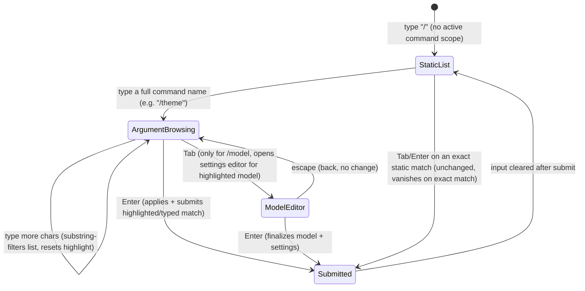

# feat: Minecraft-style command autocomplete, status bar clarity, and permissions manager

## Summary

Replace the just-shipped bordered-panel auto-open pickers for `/theme`, `/model`, and `/resume` (commit `b55be56`) with a "Minecraft-style" command autocomplete: the command token always stays visible in the input, an argument-level dropdown (extending the existing slash-autocomplete menu) shows candidates, arrow keys live-rewrite the full input line, and Enter submits the rewritten line directly. Alongside this, fix three status-bar clarity issues (model/Furnace position swap, a real context-usage percentage instead of a hardcoded `0.0%`, and a labeled theme name), add an 8-bit ASCII "FURNACE" startup banner with a welcome message, and turn `/permissions` from a one-shot "clear everything" action into an inline management panel for viewing and deleting individual permission grants.

**Target repo:** this repo (furnace). All units land on the existing branch `feat/tui-copy-command-markdown-revamp`.

## Problem Frame

The interactive TUI recently gained inline pickers for `/theme`, `/model`, and `/resume` that auto-open on an exact command match, but they clear the typed command and show a separate bordered panel with its own filter state. That is not the desired interaction: the user wants the typed command to stay in the input, a dropdown to show argument candidates, arrow keys to live-rewrite the input line in place (e.g. `/theme tokyo-night` -> `/theme gruvbox`), and Enter to submit the rewritten line as-is -- the same mental model as Minecraft's slash-command autocomplete. The existing slash-autocomplete dropdown already does something close to this for command *names*, but it hides itself the instant a typed token exactly matches a known command value, which is why `/theme` currently seems to "do nothing" until Enter.

Independently, several other rough edges surfaced in the status bar and elsewhere: the footer's context-usage number is a hardcoded literal (`0.0%`), the theme name renders with no label ("Default" reads as meaningless), the model name sits on the opposite side from where the user wants it, there is no startup branding/welcome state, and `/permissions` immediately wipes all approvals rather than letting the user inspect and selectively remove them.

## Requirements

- **R1**: Typing a bare recognized command (`/theme`, `/model`, `/resume`/`/history`) keeps the command token in the input and shows an argument-level dropdown, instead of clearing the input into a separate panel.
- **R2**: Arrow up/down live-rewrites the full input line to the highlighted argument's full command text; the dropdown stays open across repeated arrow presses (no more vanish-on-exact-match for these three commands).
- **R3**: Enter, when the current input matches one of the dropdown's argument entries, submits that command directly -- no second Enter required.
- **R4**: Typing extra characters after the command narrows the dropdown via substring matching (value/label/description), not just literal prefix, so fragments like `claude` find `anthropic/claude-3.5-sonnet`.
- **R5**: `/model`'s existing Tab-triggered per-model settings editor (reasoning effort, context length) remains reachable from the new dropdown; its internal mechanics are unchanged.
- **R6**: `/resume` dropdown entries insert a short numeric token (1-based position in the most-recently-updated session list); Enter resolves the session by that number.
- **R7**: Existing static multi-word commands (`/mode agent`, `/skills view <name>`, etc.) keep their current autocomplete behavior unchanged.
- **R8**: The bordered-panel auto-open pickers shipped in commit `b55be56` are removed and replaced, not kept alongside the new dropdown.
- **R9**: The footer swaps position so the current model name renders to the left of the "Furnace" label.
- **R10**: The footer's context-usage indicator shows a real, computed percentage of the active model's context window consumed by the current conversation, clearly labeled.
- **R11**: The footer's theme indicator is clearly labeled so it is not mistaken for an unrelated "Default" value.
- **R12**: On startup with an empty conversation, an 8-bit-style ASCII art "FURNACE" banner renders top-left using theme colors, with a short welcome message below it.
- **R13**: `/permissions` opens an inline panel (same bordered, non-full-screen shape as other inline pickers) listing the active session's permission grants, letting the user delete individual entries or clear all, instead of clearing everything immediately.

## Key Technical Decisions

- **KTD1 -- Dynamic items via the existing `onInputChange` hook.** Argument-level dropdown items for `/theme`, `/model`, `/resume` are computed in `cli.ts` (reusing the `onInputChange` plumbing already wired this session) and pushed through the existing `terminal.setSlashCommandItems(...)`, swapping back to the static command list once the input leaves that command's scope. This avoids adding a second parallel autocomplete mechanism.
- **KTD2 -- "Browsable" is a session-level flag, not a per-item property gate on matching alone.** Live-rewrite-on-arrow, no-vanish-on-exact-match, and submit-on-Enter only activate for the three dynamically-swapped argument sets. A `browsable` flag threads from `setSlashCommandItems(items, { browsable })` through UI state into `PromptInput`, keeping the existing flat command-name list and static multi-word commands (`/mode agent`, `/skills view`) byte-for-byte unchanged (R7).
- **KTD3 -- `/resume`'s numeric token is a fresh 1-based index.** `/resume <n>` resolves against `store.listSessions(cwd)` re-read at submit time (not a token cached at dropdown-render time), so a stale index from an old session list can't silently resolve to the wrong conversation.
- **KTD4 -- Model settings editor is reached via Tab on the highlighted dropdown entry.** Pressing Tab while a model is highlighted in the new dropdown (before Enter) opens the existing `ModelEditorScreen` component, scoped to that one model; finishing there (Enter/escape) finalizes or returns to the dropdown. This preserves R5 without keeping the old full-list `ModelScreen` as the primary entry point.
- **KTD5 -- Context-usage percentage reuses existing token-estimation code.** `estimateRequestTokens` and `resolveCompactionSettings` (`src/session/compaction.ts`) already estimate the current request's token footprint against the model's context window for compaction purposes; the footer reuses the same math rather than introducing new token-counting logic.
- **KTD6 -- Permissions gets the pre-redesign bordered-list pattern, not the new argument dropdown.** Permission grants are a delete-oriented list (potentially several items, each independently removable), which doesn't map to a single-value "rewrite the input line" interaction. `/permissions` reuses the `HistoryScreen`-style bordered panel + `SelectList` + type-to-filter shape instead.
- **KTD7 -- Superseded auto-open code is deleted, not deprecated in place.** The bordered-panel auto-open functions and state added in `b55be56` (`openThemePicker`/`openModelPicker`/`openHistoryPicker`, `ThemeScreen`'s filter state, full-list `HistoryScreen`/`ModelScreen` auto-entry) are removed once the new dropdown covers their scenarios, per R8.

## High-Level Technical Design

The new dropdown's interaction has three states per command scope, worth visualizing because the "browsable" mode's exact-match handling inverts the existing autocomplete's default behavior:



The left branch (`StaticList` exact-match hides the menu) is the existing, unchanged behavior for plain command names and static multi-word commands (R7). The right branch (`ArgumentBrowsing`) is new and only activates for the three dynamically-swapped item sets (KTD2).

## Implementation Units

### U1. Extend the slash-autocomplete matching engine for argument-level browsing

**Goal:** Teach `slashAutocompleteMatches` to split the typed token into a command portion and an argument portion, matching the argument portion by substring (value/label/description) instead of a single whole-string prefix test, while leaving today's whole-string prefix behavior intact when there is no argument portion yet. Add a `browsable` concept that suppresses the "exact match hides the menu" short-circuit for dynamically-swapped item sets only.

**Requirements:** R1, R2, R4, R7

**Dependencies:** none

**Files:**
- `src/ui/components/prompt-input.tsx`
- `test/smoke.test.mjs`

**Approach:** Split the normalized token on its first whitespace into `commandPart`/`argPart`. When `argPart` is empty, keep the existing `item.value.startsWith(normalized)` test unchanged. When non-empty: require `item.value` to start with `commandPart`, then match if the remainder of `item.value` starts with `argPart` OR the concatenation of `item.value`/`label`/`description` contains `argPart` (case-insensitive). The exact-match short-circuit (`items.some(v => v.value === normalized)`) only clears the menu when the exactly-matched item is not flagged `browsable`.

**Patterns to follow:** `filterThemeChoices`/`filterModels` already use the same `.includes()` substring style for their own list filtering -- mirror that convention rather than inventing a new one.

**Test scenarios:**
- (Regression) `slashAutocompleteMatches("/theme flexoki", ...)` against the flat static-only item list (no dynamic theme items present) still returns `[]`.
- (Regression) Root `"/"`, `"/th"`, `"/skills r"`, `"/skills v"` matching against the static list is unchanged from today's assertions.
- A dynamic `browsable` item set for `/theme` (bare, no argument) returns every theme entry.
- `"/model claude"` matches a `browsable` item whose value is `"/model anthropic/claude-3.5-sonnet"` via substring, even though the value does not start with `"/model claude"`.
- An exact match against a `browsable` item keeps the dropdown open (does not return `[]`).
- An exact match against a non-`browsable` item still hides the dropdown (regression guard for R7).

**Verification:** `npm run test` passes including the new and existing autocomplete assertions; `npm run typecheck` clean.

---

### U2. Live-rewrite arrow browsing and direct-submit Enter in `PromptInput`

**Goal:** When the active autocomplete matches are `browsable`, up/down arrow rewrites the visible input value to the highlighted match's value (not just moving a highlight index) and keeps the dropdown open across repeated presses. Enter, when matches exist and are `browsable`, applies the highlighted/typed match into the input and submits in the same action. Tab still only applies text without submitting, for both browsable and non-browsable cases. Non-browsable command-name completion keeps its current Tab/Enter-completes-only behavior.

**Requirements:** R1, R2, R3, R7

**Dependencies:** U1

**Files:**
- `src/ui/components/prompt-input.tsx`

**Approach:** Repeated arrow-driven rewrites must keep filtering against the state the dropdown opened with, not the just-rewritten literal text -- otherwise each rewrite would re-filter matches down to itself and sibling entries would disappear. Track a `browsableAnchor` (the token snapshot at the moment the current browsable set became active) that only updates on real keystrokes (character insert/backspace, not arrow-driven rewrites); derive `autocompleteMatches` from the anchor while browsing. Guard the existing `useEffect` that resets `selectedAutocompleteIndex` on every `value` change so it skips resets caused by the arrow-handler's own `setValue` call (e.g. via a ref flag checked and cleared inside the effect).

**Technical design (directional, not implementation-specification):**
```
onArrow(direction):
  if not browsable: move selectedIndex only (existing behavior)
  else:
    nextIndex = clamp(selectedIndex + direction, 0, matches.length - 1)
    nextValue = applySlashAutocomplete(anchorValue, anchorCursor, matches[nextIndex])
    markSelfInflictedChange()
    setValue(nextValue); setCursorOffset(nextValue.length); setSelectedIndex(nextIndex)

onEnter():
  if autocompleteActive and browsable:
    applied = applySlashAutocomplete(value, cursorOffset, matches[selectedIndex])
    setValue(""); onSubmit(applied.trim())
  else: (existing apply-only behavior)
```

**Test scenarios:**
- Test expectation: primarily interactive `useInput`/`useState` wiring inside an Ink component not exercised by the current test harness; covered through U8's manual tuistory verification (arrow-rewrite keeps sibling entries visible across repeated presses; Enter submits in one action; Tab still only applies text).
- Any pure helper extracted from this unit (e.g. next-value computation) gets a unit test alongside U1's matching tests if it is exported as a standalone function.

**Verification:** `npm run typecheck`/`build` clean; U8's tuistory pass confirms the live-rewrite and single-Enter-submit behavior end to end.

---

### U3. Dynamic argument items and direct-argument resolution for `/theme`, `/model`, `/resume`

**Goal:** Compute the per-command dynamic item list (flagged `browsable`) whenever the input is within a `/theme`, `/model`, or `/resume`/`/history` scope, pushing it via `setSlashCommandItems`, and revert to the static list otherwise. Add direct-argument submit handling so an Enter-submitted `/model <id>` and `/resume <n>` apply immediately, mirroring the existing `/theme <name>` handler.

**Requirements:** R1, R4, R5, R6, R8

**Dependencies:** U1, U2

**Files:**
- `src/cli.ts`
- `src/commands.ts`
- `src/ui/ink-terminal.tsx`
- `test/smoke.test.mjs`

**Approach:** Reuse the already-prefetched `ModelListCache` (present on this branch) for model items; build theme items from `themeChoices`; build resume items from `input.store.listSessions(cwd)` with `value: "/resume ${index + 1}"` (1-based), `label` from title, `description` from relative time. Extend `setSlashCommandItems(items, options?: { browsable?: boolean })` to thread the flag into UI state and down into `PromptInput`. Add small pure helpers (e.g. in `commands.ts`) for parsing/validating the `/resume` numeric token and resolving a `/model` argument by id or case-insensitive name, each independently testable.

**Test scenarios:**
- The theme/model/resume dynamic item builders each produce one entry per source item with the expected `value`/`label`/`description` shape.
- `/resume 1` resolves to the first (most-recently-updated) session; an out-of-range or non-numeric token is rejected without switching sessions.
- Model argument resolution finds a model by exact id and by case-insensitive name; an unknown id/name is rejected without changing the configured model.
- Scope detection correctly identifies `"/model"`, `"/model cla"`, `"/resume 2"` as in-scope for dynamic items, and rejects `"/theme x y"` (extra trailing token) and unrelated text.

**Verification:** `npm run test` passes; `npm run typecheck`/`build` clean; U8's tuistory pass confirms end-to-end behavior.

---

### U4. Remove the superseded bordered-panel auto-open pickers

**Goal:** Delete the auto-open-on-bare-command flow shipped in commit `b55be56` (`openThemePicker`/`openModelPicker`/`openHistoryPicker` invoked from `onInputChange`, `ThemeScreen`'s filter state/`useInput`, the full-list `HistoryScreen`/`ModelScreen` auto-entry paths), retaining only `ModelEditorScreen` (needed for KTD4) and whatever bordered-panel/`SelectList` scaffolding U7's permissions panel needs.

**Requirements:** R8

**Dependencies:** U3

**Files:**
- `src/cli.ts`
- `src/ui/ink-terminal.tsx`
- `src/commands.ts`
- `test/smoke.test.mjs`

**Approach:** Remove the now-dead functions and their tests (e.g. `filterThemeChoices` and its dedicated test, if nothing else uses it after the cut). Confirm during implementation whether `ModelEditorScreen` can be invoked directly from the dropdown without depending on `ModelScreen`'s local `editing`/`settingsByModel` state -- if not, lift the settings-map ownership onto the screen/session data itself so the full `ModelScreen` list wrapper is no longer required. Remove `pickerCommandFor` if nothing still calls it after the cut; keep it only if scope-detection in U3 finds it useful.

**Test scenarios:** Test expectation: none -- pure removal of superseded code; safety net is the full existing suite passing plus U8's manual verification.

**Verification:** `npm run typecheck`/`build`/`test` pass with no references to removed functions; U8's tuistory pass confirms bare `/theme`/`/model`/`/resume` no longer show the old bordered clearing-panel.

---

### U5. Status bar clarity: model/Furnace swap, real context-usage percentage, labeled theme

**Goal:** Swap the footer's first row so the current model name renders to the left of "Furnace"; replace the hardcoded `0.0%` literal with a real, computed percentage of context-window usage; label the theme name so it is not mistaken for an unrelated "Default" value.

**Requirements:** R9, R10, R11

**Dependencies:** none

**Files:**
- `src/ui/components/app-shell.tsx`
- `src/ui/ink-terminal.tsx`
- `src/cli.ts`
- `test/smoke.test.mjs`

**Approach:** `AppShellHeaderProps` gains a `contextUsagePercent: number` field; the header's first row renders the model name before the "Furnace" label; the second row's right side replaces the bare theme name with a labeled form (e.g. `theme: {displayLabel}`) and replaces `0.0%` with the computed percentage, clamped to `[0, 100]`. Compute the percentage via `estimateRequestTokens(entriesToModelMessages(...), tools) / resolveCompactionSettings(config).contextWindow * 100` at the same points `refreshCurrentSession` already runs (after turns, session switches, model/theme changes), pushed through a new `terminal.setContextUsage(percent)` method into UI state.

**Test scenarios:**
- A pure `contextUsagePercent(tokens, contextWindow)` helper returns `0` for an empty session, a proportional mid-range value for a partially-filled context, and clamps at `100` when tokens exceed the window.
- The header's row-composition function (or an equivalent testable seam) places the model name before "Furnace" in its output.

**Verification:** `npm run test` passes; `npm run typecheck`/`build` clean; U8's tuistory pass captures a screenshot confirming layout and a non-zero percentage after a real turn.

---

### U6. Startup ASCII banner and welcome message

**Goal:** On the empty-conversation state (no transcript yet), render an 8-bit block-style "FURNACE" ASCII banner top-left using theme colors, with a short welcome message beneath it, replacing the current single-line hint.

**Requirements:** R12

**Dependencies:** none

**Files:**
- `src/ui/ink-terminal.tsx`

**Approach:** Define the banner as a small constant (rows of a block character, e.g. `█`, forming block letters), rendered via `Text` lines colored with theme colors (e.g. `theme.colors.primary`). Change the empty-state `Box` in `LiveChat` to top-align (`justifyContent="flex-start"`) for this specific branch, instead of the current bottom-anchored hint. Keep the existing `/resume, /model, /theme` hint text as the welcome message below the banner.

**Test scenarios:** Test expectation: none -- static visual content with no branching logic; verified via tuistory screenshot in U8.

**Verification:** U8's tuistory pass captures a screenshot showing the banner top-left in theme colors on a fresh session, checked against at least two themes to confirm the coloring isn't hardcoded to one palette.

---

### U7. Permissions management panel

**Goal:** Replace `/permissions`'s immediate "clear everything" action with an inline bordered panel (matching the existing `HistoryScreen`-style shape) listing the active session's permission grants -- rule-based allows plus the session-wide "allow all" flag -- letting the user delete a single entry or clear all without leaving the chat view.

**Requirements:** R13

**Dependencies:** U4

**Files:**
- `src/permissions.ts`
- `src/cli.ts`
- `src/ui/ink-terminal.tsx`
- `test/smoke.test.mjs`

**Approach:** Add `SessionPermissionStore.listGrants(sessionId)` returning a normalized, removable list (each rule plus a synthetic "allow all" entry when that flag is set), and `removeGrant(sessionId, grantId)` for single-item removal; reuse the existing `clearSession(sessionId)` for "clear all". Add a `permissions` `UiScreen` kind rendered as a bordered panel with a `SelectList`-driven list of grants and a "clear all" action, wired from `/permissions` in `cli.ts`.

**Test scenarios:**
- `listGrants` returns an empty list for a session with no grants.
- Returns one entry for a single tool-allow rule and excludes rules scoped to other sessions.
- Includes a distinct "allow all" entry when that flag is set for the session.
- `removeGrant` removes exactly the targeted rule/flag and leaves the rest intact.
- Removing the "allow all" entry clears only that flag, not other rules.
- "Clear all" removes every grant for the session (re-verifies existing `clearSession` behavior).

**Verification:** `npm run test` passes; `npm run typecheck`/`build` clean; U8's tuistory pass confirms `/permissions` opens the panel (not an instant clear), a single entry can be deleted, and "clear all" empties the list.

---

### U8. Regression sweep and tuistory verification

**Goal:** Confirm the full feature set works end to end with no regressions across the branch's cumulative changes.

**Requirements:** all

**Dependencies:** U1, U2, U3, U4, U5, U6, U7

**Files:** none (verification-only)

**Approach:** Run `npm run typecheck`/`build`/`test`. Use `tuistory` to manually verify: `/theme` arrow-browse-rewrite + single-Enter-submit and substring type-to-filter (e.g. "night"); `/model` the same flow with a substring model search, plus Tab-opens-editor-then-adjust-then-finalize; `/resume` numeric-token arrow-browse + Enter, and typing a title fragment narrows the list; static commands (`/mode agent`, `/skills view`) still vanish on exact match per R7; the busy-state guard still suppresses auto-population mid-turn; footer shows model-left-of-Furnace, a non-zero context percentage after a turn, and a clearly labeled theme; a fresh session shows the ASCII banner + welcome message top-left; `/permissions` opens the panel and can delete a single grant plus clear all.

**Test scenarios:** n/a (verification-only unit).

**Verification:** All automated checks pass; tuistory screenshots captured as evidence for the footer and banner.

## Scope Boundaries

**In scope:** `/theme`, `/model`, `/resume`/`/history`, `/permissions` interaction redesigns; footer layout/labeling/percentage; startup banner + welcome message.

**Explicitly out of scope (unchanged):** `/plan`, `/mode`, `/skills`, `/compact` argument autocomplete behavior -- these keep today's flat command-name completion (R7).

### Deferred to Follow-Up Work

- Cross-session permission management (viewing/removing grants for sessions other than the active one) -- `/permissions` remains scoped to the active session, consistent with the existing `clearSession(sessionId)` API.
- Typo-tolerant/fuzzy (edit-distance) matching for argument search -- this plan adds substring matching only, not fuzzy correction.
- Animated or per-theme-variant ASCII banner artwork beyond reusing the active theme's color palette.

## Risks

- **Arrow-live-rewrite state coupling (U2)** is the most delicate piece of this plan -- getting the "anchor" filtering and the self-inflicted-value-change guard wrong risks either the dropdown collapsing to one entry after the first arrow press, or the highlighted index desyncing from the visible text. Mitigate with deliberate manual tuistory verification of repeated up/down sequences before considering U2 done.
- **`ModelScreen`/`ModelEditorScreen` decoupling (U4)** may require lifting settings-map state that today lives on the `UiScreen` "model" variant; if that refactor is larger than expected, it could bleed into U3's scope. Flag during implementation rather than silently expanding U3.
- **Removing the just-shipped code (U4)** touches recently-written, recently-tested code; the full test suite plus explicit manual regression scenarios in U8 are the safety net.

## Verification Contract

- `npm run typecheck` passes with zero errors.
- `npm run build` succeeds.
- `npm run test` passes (existing suite plus all new unit tests from U1, U3, U5, U7).
- `tuistory` manual verification (U8) confirms every scenario listed in that unit's Approach.

## Definition of Done

- All eight implementation units are complete and verified per their individual Verification sections.
- The bordered-panel auto-open pickers from `b55be56` no longer exist; `/theme`, `/model`, `/resume` all use the new argument-dropdown interaction.
- The footer shows the model name left of "Furnace", a real computed context-usage percentage, and a labeled theme name.
- A fresh session shows the ASCII "FURNACE" banner and welcome message top-left.
- `/permissions` opens a management panel rather than clearing immediately.
- `npm run typecheck`/`build`/`test` all pass.
