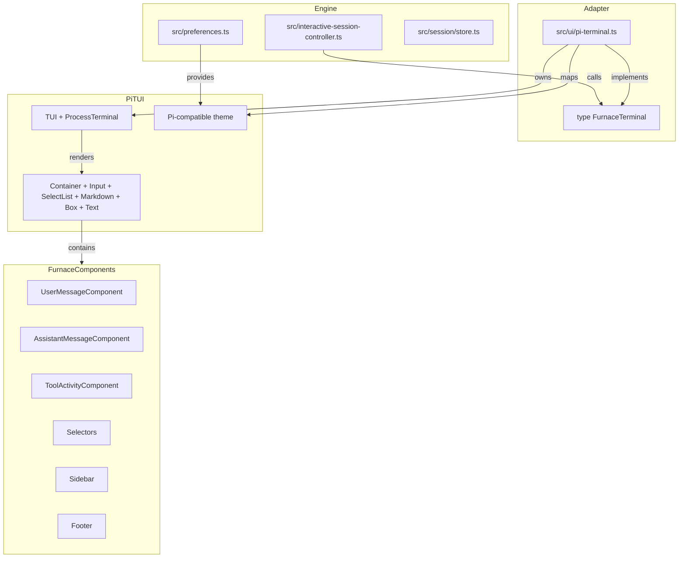

# feat: Replace Ink TUI with Pi's differential-rendered TUI while preserving Furnace's slash commands and engine

## Goal Capsule

Swap out Furnace's Ink/React-based interactive terminal UI for the exact same differential-rendered TUI library used by [Pi](https://github.com/earendil-works/pi) (`@earendil-works/pi-tui`). The agent runtime, session store, slash command definitions, permission engine, and local-first behavior remain untouched. The new TUI must honor every existing `FurnaceTerminal` contract method called by `src/interactive-session-controller.ts` so the engine can stay unchanged.

**Prior approach (Ink + React components):** superseded by this plan. `src/ui/ink-terminal.tsx` and `src/ui/components/*` are replaced; headless and piped modes are not affected.

---

## Requirements

| ID | Requirement |
|----|-------------|
| R1 | Interactive mode uses Pi's TUI primitives (`TUI`, `ProcessTerminal`, `Container`, `Input`, `SelectList`, `Markdown`, `Box`, `Text`, `FooterComponent` patterns) instead of Ink |
| R2 | All existing built-in slash commands from `src/commands.ts` remain available and autocomplete |
| R3 | `src/interactive-session-controller.ts` continues to drive the UI through the existing `FurnaceTerminal` interface without behavioral changes |
| R4 | User/assistant messages, streaming responses, tool activities, approvals, questions, model picker, history picker, settings, permissions, API key setup, and plan actions all render with Pi-style UX |
| R5 | Pinned chat sidebar, status line, lofi indicator, and context/cost footer are preserved or re-implemented with Pi primitives |
| R6 | Existing themes and theme preferences are preserved, mapped to Pi's theme system |
| R7 | Input modes (standard/vim), keybindings, autocomplete, and history search are preserved |
| R8 | Headless and piped CLI modes continue to work without the TUI |
| R9 | `npm run verify` passes after the migration |
| R10 | Pi's MIT license and design influence are documented in `docs/design-choices.md` |

---

## Key Technical Decisions

**KTD1 — Consume Pi's TUI as an npm dependency:** Use `@earendil-works/pi-tui@0.80.3` (confirmed available on npm). This is lower maintenance than vendoring, respects the MIT license automatically, and keeps the implementation aligned with upstream. If the package ever fails to install or the native prebuilds are incompatible with a target environment, fall back to vendoring the source under `vendor/pi-tui/` with license attribution.

**KTD2 — Keep the `FurnaceTerminal` interface as the adapter boundary:** Re-implement `createFurnaceTerminal` in a new module (`src/ui/pi-terminal.ts`) so `src/interactive-session-controller.ts` keeps its current import and call sites. The existing `FurnaceTerminal` type is the contract; internal Pi TUI components live behind it. This isolates the UI swap from the engine.

**KTD3 — Map themes rather than redesign them:** Furnace themes (`src/ui/terminal-themes/*.ts`) define a `Theme` shape with `colors`, `border`, and `spacing`. Pi's `theme.ts` expects a `ThemeJson` with a `colors` record and a `vars` record. Build a mapper/loader (`src/ui/pi-themes.ts`) that converts Furnace themes into Pi markdown themes and keeps the user's saved preference name stable.

**KTD4 — Preserve headless/piped paths by keeping TUI imports lazy:** The interactive session controller already imports `createFurnaceTerminal` at the top. Move the import into a dynamic `import("./ui/pi-terminal.js")` inside `runInteractive` so headless and piped modes never load Pi's TUI or native prebuilds.

**KTD5 — Reuse Pi's component patterns rather than port the whole Pi interactive mode:** Pi's `packages/coding-agent/src/modes/interactive/interactive-mode.ts` is tightly coupled to Pi's `AgentSession`. We do not import that file. Instead, we copy/adapt individual UI component patterns (`UserMessageComponent`, `AssistantMessageComponent`, `FooterComponent`, selector components) into Furnace-specific components that call back into Furnace's engine. This follows the same provenance discipline already recorded in `docs/design-choices.md` for Pi-style skills and questionnaire UX.

---

## Scope Boundaries

### In Scope
- Interactive TUI replacement: `src/ui/ink-terminal.tsx`, `src/ui/terminal.ts`, and `src/ui/components/*`.
- Adapter module: `src/ui/pi-terminal.ts` implementing `FurnaceTerminal`.
- Theme bridge: `src/ui/pi-themes.ts` plus any new Pi-compatible theme files.
- Component set: user message, assistant message, streaming message, tool activity, input/editor, footer, model/history/settings selectors, approval/question prompts, plan actions, API key setup, provider selector, permissions panel, sidebar/pinned chats.
- `src/interactive-session-controller.ts` wiring changes needed to consume the new TUI.

### Deferred to Follow-Up Work
- Animated transitions or custom scrollback behaviors beyond what Pi's `TUI` provides out of the box.
- New slash commands or TUI features not already present in `src/commands.ts`.
- Multi-pane layouts beyond the existing sidebar.
- Migrating non-interactive CLI output (e.g., `src/cli.ts` status logs) to Pi's markdown rendering.

### Outside This Product's Identity
- Changing the agent runtime, session store, tool registry, or provider model.
- Adopting Pi's `AgentSession`, extension system, or permission model.

---

## High-Level Technical Design



The new `FurnaceTerminal` implementation creates a single `TUI` instance backed by `ProcessTerminal`. It builds a layout container hierarchy: header/footer around a scrollable chat area plus an editor area. When the session controller calls `setTranscript`, the adapter rebuilds the chat container with `UserMessageComponent` and `AssistantMessageComponent` instances. When it calls `setStreamingContent`, the adapter updates a live `AssistantMessageComponent` in place. Input is handled by Pi's `Input` component (or the `Editor` component for multi-line), and its key events are translated to Furnace's existing callbacks (`onSubmit`, `onInterrupt`, `onAutocompleteTab`, etc.). Slash commands are fed into Pi's `AutocompleteProvider` via the `SlashCommand` shape.

---

## Output Structure

After this change the UI layer looks like:

```text
src/ui/
├── pi-terminal.ts          # new: FurnaceTerminal adapter using Pi TUI
├── pi-themes.ts            # new: Furnace -> Pi theme mapper
├── pi-components/          # new: Furnace-specific Pi components
│   ├── user-message.ts
│   ├── assistant-message.ts
│   ├── tool-activity.ts
│   ├── footer.ts
│   ├── sidebar.ts
│   └── selectors.ts
├── terminal.ts             # retained: fallback readline printer for non-TUI paths
└── components/             # deleted: Ink components (after migration is complete)
```

`src/ui/ink-terminal.tsx` is removed once the new adapter is fully wired and tested. Old `src/ui/terminal-themes/*.ts` are preserved until the theme mapper proves it can convert them, then they are either kept as source themes or merged into Pi-compatible files under `src/ui/pi-themes/`.

---

## Implementation Units

### U1. Branch setup and dependency integration

**Goal:** Create an isolated feature branch and add Pi's TUI package so the build can resolve it.

**Requirements:** R1, R9

**Dependencies:** None

**Files:**
- `package.json`
- `package-lock.json`
- `tsconfig.json` (if path mapping is needed)
- `scripts/with-node22.sh` (if native module rebuild is needed)

**Approach:**
- Create `feat/pi-tui` from `main`.
- Run `npm install --save-exact @earendil-works/pi-tui@0.80.3` using the Node 22 wrapper.
- Confirm the native prebuilds load on macOS and note the Windows prebuild path for later testing.
- Add the package to `esbuild` externals if it bundles native `.node` files that should not be inlined.

**Patterns to follow:** Existing pinned dependencies and the `save-exact` convention from `package.json` and `package-lock.json`.

**Test scenarios:**
- Happy: `npm run check-node` passes and `npm install` resolves `@earendil-works/pi-tui`.
- Integration: `npm run build` succeeds after adding the dependency.
- Error: A missing prebuild fails with a clear error and the fallback vendoring path is documented.

**Verification:** `npm run build` passes on the feature branch.

---

### U2. Theme mapping and adapter

**Goal:** Convert Furnace's existing theme definitions into Pi's `MarkdownTheme` / `EditorTheme` / `ThemeJson` shape so the new TUI can apply them.

**Requirements:** R6

**Dependencies:** U1

**Files:**
- `src/ui/pi-themes.ts` (new)
- `src/ui/terminal-themes/flexoki.ts`
- `src/ui/terminal-themes/extra.ts`
- `src/ui/terminal-themes/generated.ts`
- `src/ui/terminal-themes/index.ts`
- `src/preferences.ts` (theme preference read)

**Approach:**
- Define a `toPiMarkdownTheme(furnaceTheme: Theme): MarkdownTheme` function.
- Map Furnace `colors` to Pi color names (`accent`, `border`, `error`, `text`, `userMessageBg`, `userMessageText`, `mdHeading`, `mdCode`, etc.).
- Provide a `getPiEditorTheme()` and `getPiSelectListTheme()` derived from the same Furnace theme.
- Keep `resolveTheme()` and `themeChoices()` in `src/ui/terminal-themes/index.ts` returning the existing names so preferences stay stable.

**Patterns to follow:** `packages/coding-agent/src/modes/interactive/theme/theme.ts` in Pi for `MarkdownTheme` and `EditorTheme` construction; Furnace's existing `Theme` type for the source shape.

**Test scenarios:**
- Happy: Each Furnace theme converts to a valid Pi theme without `undefined` colors.
- Edge: The default theme has all required Pi color keys.
- Error: A theme missing a mapped color falls back to the default value and logs a warning.
- Integration: Switching `/theme` applies the new Pi theme immediately.

**Verification:** A unit test asserts every Pi-required color key is present after conversion for all shipped themes.

---

### U3. Core terminal adapter

**Goal:** Create a new `FurnaceTerminal` implementation backed by Pi's `TUI` and `ProcessTerminal`.

**Requirements:** R1, R3, R8

**Dependencies:** U1, U2

**Files:**
- `src/ui/pi-terminal.ts` (new)
- `src/ui/ink-terminal.tsx` (reference during build, then deleted)
- `src/interactive-session-controller.ts` (lazy import change)

**Approach:**
- Export `createFurnaceTerminal` and `type FurnaceTerminal` from `src/ui/pi-terminal.ts`.
- Implement the full `FurnaceTerminal` interface with Pi TUI internals: create `TUI`, layout `Container`s, and wire `onInputChange`, `onSubmit`, `onInterrupt`, etc.
- Move the `createFurnaceTerminal` import in `src/interactive-session-controller.ts` to a dynamic import inside `runInteractive` so non-interactive modes never load Pi's native prebuilds.
- Keep `src/ui/terminal.ts` for the fallback readline path.

**Patterns to follow:** Pi's `InteractiveMode` constructor in `packages/coding-agent/src/modes/interactive/interactive-mode.ts` for `TUI`/`ProcessTerminal` setup and container layout; Furnace's existing `FurnaceTerminal` type for the contract.

**Test scenarios:**
- Happy: `createFurnaceTerminal(...)` starts, renders, and stops cleanly.
- Edge: Terminal resize re-renders the layout without throwing.
- Error: An exception during render is caught and reported as a status notice.
- Integration: `runInteractive()` returns successfully after `terminal.run()` and `terminal.stop()`.

**Verification:** A new integration test spawns the CLI in interactive mode and exits immediately; no uncaught exceptions occur.

---

### U4. Message transcript and streaming rendering

**Goal:** Render user and assistant messages, including streaming assistant content, using Pi's components.

**Requirements:** R4

**Dependencies:** U3

**Files:**
- `src/ui/pi-components/user-message.ts` (new)
- `src/ui/pi-components/assistant-message.ts` (new)
- `src/ui/pi-terminal.ts`
- `src/ui/pi-components/tool-activity.ts` (new, created in U4 but finalized in U5)

**Approach:**
- Create `UserMessageComponent` as a `Container` with a `Box` background and a `Markdown` child, following Pi's `UserMessageComponent` pattern.
- Create `AssistantMessageComponent` as a `Container` that can update its `Markdown` child as streaming tokens arrive.
- On `setTranscript`, rebuild the chat container with a sequence of user/assistant components plus `Spacer` separators.
- On `setStreamingContent`, append or update a streaming `AssistantMessageComponent`.
- Add `OSC133` zone markers only if the terminal advertises shell integration support, matching Pi's behavior.

**Patterns to follow:** `packages/coding-agent/src/modes/interactive/components/user-message.ts` and `assistant-message.ts` for layout, spacing, and OSC133 handling.

**Test scenarios:**
- Happy: A transcript with one user and one assistant message renders two components.
- Happy: Streaming tokens append to the same assistant component.
- Edge: Empty assistant content renders nothing without crashing.
- Error: Malformed markdown in a streamed token does not break the render.
- Integration: `setTranscript` followed by `setStreamingContent` produces the expected visual sequence.

**Verification:** Render output is captured in a unit test and compared against expected line counts and marker presence.

---

### U5. Tool activities and status indicators

**Goal:** Display tool-call lifecycle (running/done/failed) and status notices using Pi's primitives.

**Requirements:** R4, R5

**Dependencies:** U4

**Files:**
- `src/ui/pi-components/tool-activity.ts` (new)
- `src/ui/pi-components/status-indicator.ts` (new)
- `src/ui/pi-terminal.ts`

**Approach:**
- Create `ToolActivityComponent` that renders a bordered summary (tool name, args, status) and expands on demand to show the result via `DynamicBorder` or a simple `Box`.
- Map `ToolActivity` status to Pi color helpers (`theme.fg("success")`, `theme.fg("error")`, `theme.fg("dim")`).
- Implement `setToolActivities`, `clearToolActivities`, `setThinking`, `setBusy`, and `setStatusNotice` in the adapter by adding/removing status components from the status container.

**Patterns to follow:** Pi's `ToolExecutionComponent` and `BashExecutionComponent` in `packages/coding-agent/src/modes/interactive/components/` for bordered tool output and status styling.

**Test scenarios:**
- Happy: A running tool renders with a spinner/loader and a dim border.
- Happy: A completed tool updates to a success border and shows the result when expanded.
- Error: A failed tool renders with an error-colored border and summary.
- Integration: Tool activities synchronize with `runtimeUi.toolActivities` updates from the session controller.

**Verification:** `setToolActivities` with a sample running-and-done sequence renders correctly in a unit test.

---

### U6. Input, slash commands, and autocomplete

**Goal:** Replace the prompt input with Pi's `Input` or `Editor` component and wire Furnace's slash commands into Pi's autocomplete.

**Requirements:** R2, R4, R7

**Dependencies:** U3

**Files:**
- `src/ui/pi-components/prompt-input.ts` (new)
- `src/ui/pi-terminal.ts`
- `src/commands.ts` (kept as source of truth)
- `src/slash-command-router.ts` (if adjustments are needed)

**Approach:**
- Use Pi's `Input` component for single-line prompts and `Editor` for multi-line/editor mode.
- Feed `slashCommandDefinitions` from `src/commands.ts` into a `CombinedAutocompleteProvider` with a `SlashCommand` array.
- Implement argument-level completions for `/model`, `/theme`, `/fork`, `/resume`, etc., reusing the existing `argumentScopeFor` logic.
- Wire `onSubmit`, `onInterrupt`, `onAutocompleteTab`, `onAutocompleteHover`, `onBareTab`, `onCopy`, `onOpenEditor`, and `onModeCycle` to the session controller's existing callbacks.
- Preserve vim input mode by mapping the mode toggle to Pi's keybindings.

**Patterns to follow:** Pi's `createBaseAutocompleteProvider` in `packages/coding-agent/src/modes/interactive/interactive-mode.ts` for slash-command autocomplete wiring; Pi's `Input` and `Editor` components for keyboard handling.

**Test scenarios:**
- Happy: Typing `/` shows the full slash command list.
- Happy: Typing `/mod` filters to `/model` and selecting it inserts `/model `.
- Happy: `/model ` shows available models in autocomplete.
- Edge: Non-slash input does not trigger slash autocomplete.
- Error: An unknown slash command is rejected by the input handler and not submitted to the agent.
- Integration: Submitting a slash command reaches the session controller's `handleSlashCommand` path.

**Verification:** A keyboard-driven test sends simulated key sequences and asserts the final input value and callback invocations.

---

### U7. Selectors and dialogs

**Goal:** Reimplement all modal/picker UIs with Pi's `SelectList`, `SettingsList`, and overlay containers.

**Requirements:** R4, R7

**Dependencies:** U3, U6

**Files:**
- `src/ui/pi-components/selectors.ts` (new)
- `src/ui/pi-terminal.ts`

**Approach:**
- Implement `showModelEditor`, `showSettings`, `showProviderSelector`, `showApiKeySetup`, `showPermissions`, `showPlanActions`, `requestApproval`, and `requestQuestions` as overlays or editor-container replacements using Pi's `SelectList`, `SettingsList`, and `Input` components.
- For API key setup, use a masked `Input` with custom key handling.
- For approvals and questions, use `SelectList` with the appropriate choice items.
- Restore the normal editor when the selector closes.

**Patterns to follow:** Pi's `ModelSelectorComponent`, `SettingsSelectorComponent`, `LoginDialogComponent`, and `ExtensionSelectorComponent` in `packages/coding-agent/src/modes/interactive/components/`.

**Test scenarios:**
- Happy: Model picker renders all choices and the callback receives the selected model.
- Happy: Settings list renders current preferences and the save callback receives updated values.
- Edge: Canceling a selector restores the editor without side effects.
- Error: A selector with zero items shows a helpful message and can be dismissed.
- Integration: `/model` -> pick model -> `setModel` called with correct id and settings.

**Verification:** Each selector has a unit test that renders it and invokes the selection callback.

---

### U8. Sidebar and pinned chats

**Goal:** Rebuild the pinned-chat sidebar using Pi's `Container` and `SelectList` so multi-session switching still works.

**Requirements:** R5

**Dependencies:** U3, U7

**Files:**
- `src/ui/pi-components/sidebar.ts` (new)
- `src/ui/pi-terminal.ts`

**Approach:**
- Create `SidebarComponent` as a vertical `Container` of truncated text rows, one per pinned chat slot.
- Highlight the active session, show queued counts, and unread indicators using Pi's color helpers.
- Wire click/keyboard selection to `onPinnedSelect` and `onPinnedUnpin` callbacks.
- Toggle visibility with `setSidebarEnabled`.

**Patterns to follow:** Furnace's existing `PinnedChatSummary` shape and `src/ui/ink-terminal.tsx` pinned-chat rendering logic; Pi's `SelectList` for selection behavior if it fits the single-column layout.

**Test scenarios:**
- Happy: Four pinned chats render with correct titles and active highlight.
- Happy: Selecting a pinned chat fires `onPinnedSelect` with the right slot.
- Edge: Empty pinned chat slots render as placeholders and cannot be selected.
- Integration: Toggling the sidebar with the keybinding or `/settings` hides/shows the panel.

**Verification:** `setPinnedChats` with a sample summary renders the expected sidebar output and selection callback is invoked.

---

### U9. Interactive session controller integration

**Goal:** Connect the new adapter to the engine without changing engine behavior.

**Requirements:** R3, R8, R9

**Dependencies:** U3–U8

**Files:**
- `src/interactive-session-controller.ts`
- `src/ui/pi-terminal.ts`
- `src/ui/terminal.ts`

**Approach:**
- Replace the static import of `createFurnaceTerminal` with a dynamic import inside `runInteractive`.
- Update all call sites that pass `FurnaceTerminal`-typed callbacks to use the new adapter's event signatures (no signature changes expected).
- Keep `clearTerminalViewportAndScrollback` and the readline fallback in `src/ui/terminal.ts` for piped/headless use.
- Run the full test suite and fix any regressions.

**Patterns to follow:** Existing lazy-loading patterns in `src/cli.ts` for headless mode; the `FurnaceTerminal` contract in `src/ui/ink-terminal.tsx` (until it is removed).

**Test scenarios:**
- Happy: Interactive mode starts and accepts a prompt.
- Happy: Headless mode `furnace -p "hello"` works without loading Pi's TUI.
- Integration: Piped stdin mode works without the TUI.
- Error: A TUI render failure falls back to a readable error message instead of crashing the process.

**Verification:** `npm run verify` passes; manual smoke test of interactive, headless, and piped modes.

---

### U10. Cleanup, dependency removal, and documentation

**Goal:** Remove the old Ink stack once the new TUI is fully functional and document the Pi influence.

**Requirements:** R9, R10

**Dependencies:** U9

**Files:**
- `src/ui/ink-terminal.tsx` (delete)
- `src/ui/components/app-shell.tsx` (delete)
- `src/ui/components/prompt-input.tsx` (delete)
- `src/ui/components/select-list.tsx` (delete)
- `src/ui/components/spinner.tsx` (delete)
- `src/ui/components/theme-provider.tsx` (delete)
- `src/ui/components/utils.ts` (delete if unused)
- `package.json`
- `docs/design-choices.md`
- `docs/tools.md` or `docs/interaction-model.md` if TUI references are outdated

**Approach:**
- Delete all `src/ui/components/*` files after confirming no other code imports them.
- Remove `ink`, `react`, `@types/react`, and related React-only dependencies from `package.json` if they are no longer used.
- Update `docs/design-choices.md` with a "Pi TUI Adoption" section explaining the source, the adapter boundary, and the local adaptation (keeping Furnace's engine and slash commands).
- Update any docs that reference `ink-terminal.tsx` or Ink components.

**Patterns to follow:** The existing harness-influence notes in `docs/design-choices.md` for Pi, OpenCode, Headroom, etc.

**Test scenarios:**
- Happy: `npm run build` passes after deleting Ink files.
- Happy: `npm run verify` passes with no remaining React/Ink imports.
- Error: A stale import of a deleted component fails the build with a clear resolution.

**Verification:** `grep -r "ink\|react" src/ | grep -v "node_modules"` returns no relevant matches; `npm run verify` passes.

---

## Risks & Dependencies

| Risk | Likelihood | Impact | Mitigation |
|------|------------|--------|------------|
| Pi's native keyboard-modifier prebuilds fail on some macOS/Windows versions | Medium | High | Keep vendoring fallback path documented; test `npm run build` on target platforms before merging. |
| Pi's `TUI` differential renderer behaves differently from Ink on terminal resize/clear | Medium | High | Add resize tests and manual smoke tests in `Terminal.app`, `iTerm2`, `tmux`, and `ghostty`. |
| Some Furnace UI features (lofi, sidebar, image paste) have no exact Pi equivalent | Medium | Medium | Build custom Furnace components using Pi primitives; defer polish to follow-up if needed. |
| Keyboard shortcuts and input mode behavior differ between Ink and Pi | Medium | High | Map existing keybindings to Pi's `KeybindingsManager` and keep user preferences. |
| Removing Ink accidentally breaks headless/piped mode due to shared import | Low | High | Make TUI import dynamic and verify non-TUI paths in CI. |

**Dependencies:**
- `@earendil-works/pi-tui@0.80.3` must remain available on npm (confirmed today; fallback is vendoring).
- Pi's MIT license allows reuse with attribution; license file must be retained if vendoring.
- Node 22.x runtime (already pinned by Furnace).

---

## Test Scenarios

| Unit | Happy Path | Edge Case | Error/Failure | Integration |
|------|------------|-----------|---------------|-------------|
| U1 | Package installs and builds | Native prebuild loads on darwin | Prebuild missing, fallback documented | `npm run build` passes |
| U2 | Theme maps to all Pi keys | Default theme fallback | Missing color key logged | `/theme` switch applies |
| U3 | TUI starts/stops | Resize re-renders | Render error caught | `runInteractive()` lifecycle |
| U4 | User + assistant messages render | Empty content skipped | Malformed markdown safe | Streaming + transcript |
| U5 | Tool running/done renders | No activities shows nothing | Failed tool highlighted | `runtimeUi` updates |
| U6 | Slash autocomplete filters | Non-slash input ignored | Unknown command rejected | Submit reaches controller |
| U7 | Model picker selects | Cancel restores editor | Empty selector message | `/model` flow end-to-end |
| U8 | Pinned chats highlight | Empty slots placeholder | Invalid slot ignored | Sidebar toggle |
| U9 | Interactive prompt works | Headless skips TUI | TUI error graceful | Headless/piped/interactive |
| U10 | Build after Ink removal | No stale imports | Missing doc reference caught | `npm run verify` |

---

## Documentation Plan

- Update `docs/design-choices.md` with a "Pi TUI Adoption" section: source (`https://github.com/earendil-works/pi`), license (MIT), adapter boundary (`FurnaceTerminal`), and Furnace-specific adaptations (engine unchanged, slash commands preserved, custom sidebar/lofi).
- Update `AGENTS.md` if it references the Ink UI architecture.
- Update `README.md` TUI screenshots/description only if the README currently shows Ink-specific UI.
- Delete or update any docs that mention `src/ui/ink-terminal.tsx` or `src/ui/components/*`.

---

## Sources & Research

- Pi repository cloned to `/tmp/pi` for plan analysis.
- `packages/tui/src/index.ts` and `packages/tui/src/tui.ts` — Pi's TUI primitive API.
- `packages/coding-agent/src/modes/interactive/interactive-mode.ts` — how Pi's coding agent wires its engine to the TUI (used as a pattern reference, not a direct dependency).
- `packages/coding-agent/src/modes/interactive/components/user-message.ts`, `assistant-message.ts`, `footer.ts`, `selectors` — component patterns to adapt.
- `packages/coding-agent/src/core/slash-commands.ts` — Pi's slash command shape for autocomplete mapping.
- `@earendil-works/pi-tui@0.80.3` confirmed on npm public registry.
- Pi license: MIT (`/tmp/pi/LICENSE`).
